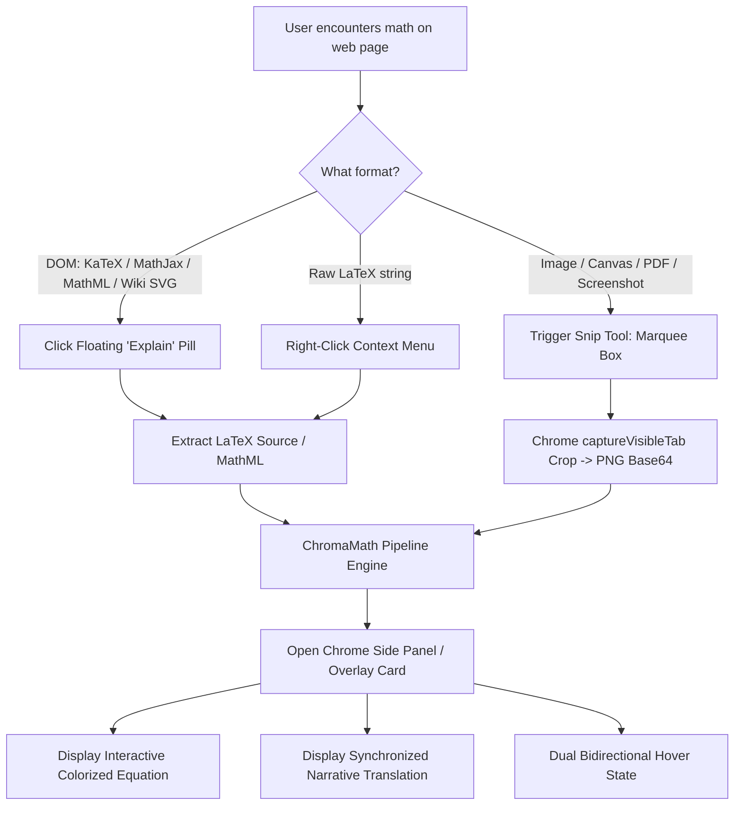
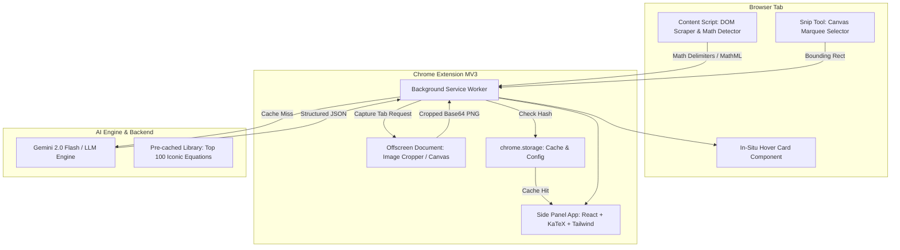
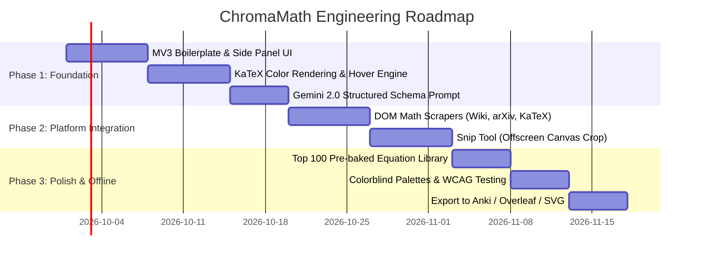

# Design Document: "ChromaMath" (Read Better Maths)
### Intuitive, Color-Coordinated Equation Explainer Chrome Extension

**Status:** Draft / Proposed  
**Author:** AI Architecture Team & Rishabh  
**Target Platform:** Google Chrome (Manifest V3)  
**Inspiration:** Kalid Azad's [BetterExplained](https://betterexplained.com/articles/colorized-math-equations/) ADEPT Method & Colorized Equations  

---

## 1. Executive Summary & Vision

### 1.1 The Problem
Mathematical notation is dense, terse, and historical. While mathematically rigorous, conventional equations obscure the **narrative** of what is happening. For instance, in Euler’s formula ($e^{ix} = \cos x + i\sin x$) or the Discrete Fourier Transform ($X_k = \frac{1}{N}\sum_{n=0}^{N-1}x_n e^{-i 2\pi k n / N}$), students see an intimidating soup of summations, exponents, indices, and constants. 

As Kalid Azad noted:
> *"Concepts like 'energy', 'path', 'spin' aren’t directly stated in the equation... The colors, text, and equations are themselves a diagram. Our eyes bounce back and forth, reading the equation like a map (not a string of symbols)."*

### 1.2 The Solution: ChromaMath
**ChromaMath** is a Chrome extension that transforms any mathematical equation encountered on the web (arXiv papers, Wikipedia, lecture notes, blogs, Substack, and PDFs) into an **intuitive, color-coordinated cognitive map**.

It generates:
1. **The Color-Segmented Equation:** Symbols grouped into semantic units and assigned distinct, colorblind-safe hues.
2. **The Plain-English Translation:** A narrative sentence where each phrase shares the exact color of the mathematical symbol it describes.
3. **Dual Bidirectional Hover Highlighting:** Hovering over a term in the formula illuminates the plain-English phrase, and hovering over a word highlights the corresponding symbol in the formula.
4. **ADEPT Deep Dive Card:** Analogy, Diagram/Intuition, Example, Plain-English, and Technical definition.

```
       [ X_k ]   =  [ 1/N ∑ ]   [ x_n ]       [ e^{i 2π k n/N} ]
       (Purple)     (Magenta)    (Blue)            (Orange)
          │             │          │                  │
          ▼             ▼          ▼                  ▼
"To find the energy  average a   your signal   spun around a circle
 at frequency k,     sample..."                at that frequency"
```

---

## 2. Core Philosophy: The ADEPT Method

The extension builds upon the **ADEPT** framework:
- **A – Analogy:** What is this concept like in everyday life? (e.g., Fourier Transform = "unmixing a smoothie into its individual fruit ingredients").
- **D – Diagram / Visual Map:** The color-coded equation *is* the diagram. Colors link the abstract symbol to the tangible intuition.
- **E – Example:** A simple, real-world case showing the math in motion.
- **P – Plain-English Definition:** A natural-sounding sentence free of textbook jargon.
- **T – Technical Definition:** The formal definition, preserving complete mathematical rigor.

---

## 3. User Experience & User Flow

### 3.1 Three Ways to Capture / Activate Math
Users encounter math in diverse formats across the web:

1. **Auto-Detect / Hover Pill (Native Web Math):**
   - Detects KaTeX (`.katex`), MathJax (`.MathJax`, `.mjx-chtml`), MathML (`<math>`), and Wikipedia Math SVGs (`.mwe-math-fallback-image-inline`).
   - Displays an unobtrusive subtle floating wand icon (`✨ Explain`) next to the formula when hovered or clicked.
2. **Snip & Capture (OCR / Multimodal Vision):**
   - For raster images, canvas renderers, scanned books, or embedded PDF documents (e.g. arXiv PDF viewer).
   - User triggers a screenshot marquee tool (`Alt + M` or `Cmd + Shift + X`), drags a crop box around the equation, and the image is processed directly via Multimodal Vision AI.
3. **Context Menu / Selection:**
   - Select raw LaTeX text (e.g., `$E = mc^2$`), right-click -> *"Explain Equation with ChromaMath"*.



### 3.2 Display Modes

#### A. Chrome Side Panel (Primary Reading Mode)
- Opens in Chrome's native Side Panel API (`chrome.sidePanel`), docked alongside the paper or article.
- Keeps reading flow intact without covering content.
- Allows pin-history of equations explored during a reading session.

#### B. Floating In-Situ Hover Card (Quick Peek)
- A compact tooltip popping up right under the equation on the webpage for rapid reading without leaving the reading line.
- Can be expanded into the Side Panel with one click.

#### C. Studio / Export Drawer
- Export as **Overleaf/LaTeX snippet** (pre-formatted with `\color` or `\textcolor`), **Anki Flashcard**, **SVG/PNG**, or **Markdown**.

---

## 4. System Architecture (Manifest V3)



### 4.1 Manifest V3 Components

1. **Background Service Worker (`service-worker.ts`):**
   - Manages extension lifecycle, context menus, keyboard shortcuts.
   - Coordinates messaging between content scripts, offscreen documents, and the side panel.
   - Proxies API calls to the LLM backend with secure API key storage in `chrome.storage.sync`.

2. **Content Script (`content-script.ts`):**
   - Runs on all pages (`<all_urls>`).
   - Uses `MutationObserver` to passively detect math DOM elements (KaTeX, MathJax, MathML).
   - Injects the floating interactive pills and in-page hover cards.
   - Injects the screen snip crosshair UI when triggered.

3. **Offscreen Document (`offscreen.html` / `offscreen.ts`):**
   - MV3 service workers lack DOM and Canvas access.
   - When snipping equations, the service worker captures the visible tab (`chrome.tabs.captureVisibleTab`), sends the full screenshot and crop coordinates to the offscreen document, which crops the image on a `<canvas>` and returns a clean, compact PNG data URL.

4. **Side Panel Application (`sidepanel.html`):**
   - Built with React, Tailwind CSS, and KaTeX.
   - Renders the interactive color breakdown, ADEPT cards, history tab, and export tool.

---

## 5. Multimodal AI & Parsing Pipeline

### 5.1 The LLM Engine: Gemini 2.0 Flash
Gemini 2.0 Flash is chosen for:
- **Sub-second latency** (< 800ms response time).
- **Multimodal native vision** (can read blurry math screenshots and PDFs directly without requiring separate OCR).
- **Strict Structured Outputs (JSON Schema)**.

### 5.2 Structured JSON Schema
The AI is instructed to return a strictly typed JSON object:

```typescript
interface ColorizedMathResponse {
  equation_title: string;          // e.g., "Discrete Fourier Transform"
  raw_latex: string;               // Normalized LaTeX
  colorized_latex: string;         // LaTeX with \htmlClass or \textcolor tags
  plain_english_sentence: string;  // Complete grammatical sentence explaining the whole
  
  components: Array<{
    id: string;                    // e.g., "c1", "c2"
    latex_chunk: string;           // e.g., "X_k"
    plain_english_phrase: string;  // e.g., "the energy at a particular frequency"
    technical_name: string;        // e.g., "Frequency domain sample at bin k"
    intuitive_role: string;        // e.g., "The target frequency recipe amount"
    color_token: string;           // e.g., "color-1", "color-2"
    suggested_hex: string;         // e.g., "#8A2BE2"
  }>;

  adept: {
    analogy: string;               // e.g., "Separating a fruit smoothie back into ingredients"
    diagram_concept: string;       // Guidance on visual geometry (e.g., "Circle spin")
    simple_example: string;        // Concrete numerical or scenario example
    plain_definition: string;      // One paragraph summary in layperson terms
    technical_definition: string;  // Rigorous mathematical description
  };
}
```

### 5.3 System Prompt Strategy & Few-Shot Templates
The prompt instructs the model to adhere to the BetterExplained style:

```text
You are an expert mathematical communicator and pedagogue in the style of BetterExplained (Kalid Azad).
Your job is to deconstruct a mathematical equation into an intuitive, color-coordinated cognitive map.

Rules:
1. Break the equation down into 4 to 7 semantic conceptual chunks (do not break down into single symbols if they belong together conceptually, e.g., '\lim_{n\to\infty}' or '\frac{1}{N}\sum_{n=0}^{N-1}' is a single conceptual chunk: 'average a bunch of points').
2. Formulate a single, natural, beautifully written Plain-English sentence where each phrase corresponds 1-to-1 to a math chunk.
3. Every math chunk must have an exact corresponding phrase in the sentence.
4. Provide an ADEPT (Analogy, Diagram idea, Example, Plain definition, Technical definition) breakdown.
```

#### Few-Shot Anchor 1: Definition of $e$
- **Equation:** $e = \lim_{n \to \infty} \left(1 + \frac{1}{n}\right)^{1 \cdot n}$
- **Plain-English:** *"The base for continuous growth is the unit quantity earning unit interest for unit time, compounded as fast as possible."*
- **Component Map:**
  - $e$ $\rightarrow$ *"The base for continuous growth"*
  - $1$ $\rightarrow$ *"the unit quantity"*
  - $\frac{1}{...}$ (interest) $\rightarrow$ *"earning unit interest"*
  - $^{1 \cdot ...}$ $\rightarrow$ *"for unit time"*
  - $n$ $\rightarrow$ *"compounded"*
  - $\lim_{n \to \infty}$ $\rightarrow$ *"as fast as possible"*

#### Few-Shot Anchor 2: Discrete Fourier Transform
- **Equation:** $X_k = \frac{1}{N} \sum_{n=0}^{N-1} x_n e^{-i 2\pi k \frac{n}{N}}$
- **Plain-English:** *"To find the energy at a particular frequency, spin your signal around a circle at that frequency, and average a bunch of points along that path."*
- **Component Map:**
  - $X_k$ $\rightarrow$ *"the energy at a particular frequency"*
  - $x_n$ $\rightarrow$ *"your signal"*
  - $e^{-i...}$ $\rightarrow$ *"spin... around a circle"*
  - $2\pi k \frac{n}{N}$ $\rightarrow$ *"at that frequency"*
  - $\frac{1}{N} \sum_{n=0}^{N-1}$ $\rightarrow$ *"average a bunch of points along that path"*

---

## 6. Color Palette & Accessibility Architecture

A major critique of color-coded math is accessibility for readers with color vision deficiencies (CVD). ChromaMath solves this with a **multi-sensory accessibility design**:

### 6.1 The Palette System
1. **Default Modern Vibrant Palette:** High-contrast, friendly, engaging tones.
2. **Colorblind-Safe Palette (Wong / Okabe-Ito):** Scientifically designed to be distinguishable for protanopia, deuteranopia, and tritanopia.
3. **High-Contrast Dark Mode Palette:** Optimized for OLED and dark PDF readers.

| Color ID | Default Vibrant | Okabe-Ito (CVD Safe) | High Contrast Dark |
|:---:|:---:|:---:|:---:|
| **Color 1** | `#7C3AED` (Purple) | `#0072B2` (Blue) | `#A78BFA` (Light Purple) |
| **Color 2** | `#2563EB` (Blue) | `#E69F00` (Orange) | `#60A5FA` (Sky Blue) |
| **Color 3** | `#059669` (Green) | `#009E73` (Bluish Green) | `#34D399` (Emerald) |
| **Color 4** | `#DC2626` (Red) | `#D55E00` (Vermillion) | `#F87171` (Coral) |
| **Color 5** | `#D97706` (Amber) | `#CC79A7` (Reddish Purple) | `#FBBF24` (Gold) |
| **Color 6** | `#DB2777` (Magenta) | `#F0E442` (Yellow/Dark Border) | `#F472B6` (Pink) |

### 6.2 Non-Color Secondary Signifiers (Accessibility Mode)
To ensure compliance with **WCAG 2.1 Level AA**:
- **Numbered Badges / Superscripts:** Each symbol and its explanation phrase are marked with matching superscript badges: `[1]`, `[2]`, `[3]`.
- **Underline Patterns:** Different border styles (e.g. solid, dashed, wavy, double, dotted) applied simultaneously to the math token and plain text phrase.
- **Dynamic Synchronized Hover State:** Hovering dims all unrelated components by 75% opacity and raises the target component with a glowing halo, making color perception secondary.

---

## 7. Interactive Rendering & KaTeX Integration

### 7.1 KaTeX Custom Color Macro Strategy
KaTeX allows styling formulas via macros or HTML extensions:
- Using `\textcolor{#HEX}{...}`: Directly colors the symbols in pure KaTeX.
- Using KaTeX HTML extensions `\htmlClass{color-token-c1}{...}`: Generates DOM elements with semantic classes.

```html
<!-- Rendered Output Example -->
<div class="chromamath-container">
  <!-- Formula Area -->
  <div class="equation-display">
    <span class="token c1" data-comp-id="c1">X_k</span>
    <span class="plain">=</span>
    <span class="token c2" data-comp-id="c2">\frac{1}{N}\sum_{n=0}^{N-1}</span>
    <span class="token c3" data-comp-id="c3">x_n</span>
    <span class="token c4" data-comp-id="c4">e^{-i 2\pi k \frac{n}{N}}</span>
  </div>

  <!-- Synchronized Plain-English Narrative -->
  <div class="narrative-sentence">
    To find <span class="phrase c1" data-comp-id="c1">the energy at a particular frequency</span>, 
    <span class="phrase c4" data-comp-id="c4">spin</span> 
    <span class="phrase c3" data-comp-id="c3">your signal around a circle at that frequency</span>, 
    and <span class="phrase c2" data-comp-id="c2">average a bunch of points along that path</span>.
  </div>
</div>
```

### 7.2 Event Synchronization Hook
```javascript
// Synchronized Hover Event Engine
document.querySelectorAll('[data-comp-id]').forEach(el => {
  el.addEventListener('mouseenter', () => {
    const id = el.getAttribute('data-comp-id');
    document.querySelectorAll(`[data-comp-id="${id}"]`).forEach(target => {
      target.classList.add('highlight-active');
    });
    document.querySelectorAll(`[data-comp-id]:not([data-comp-id="${id}"])`).forEach(other => {
      other.classList.add('highlight-dimmed');
    });
  });

  el.addEventListener('mouseleave', () => {
    document.querySelectorAll('.highlight-active, .highlight-dimmed').forEach(el => {
      el.classList.remove('highlight-active', 'highlight-dimmed');
    });
  });
});
```

---

## 8. Supported Web Platforms & Math Extractors

| Platform | Rendering Tech | ChromaMath Extraction Strategy |
|:---|:---|:---|
| **arXiv (HTML / ar5iv)** | MathML / KaTeX | Query `span.katex-math` or `<math>` attributes; extract `alttext` or LaTeX annotation. |
| **arXiv (Standard PDF)** | Canvas / PDF.js | Snip Marquee Tool (`captureVisibleTab` + Vision AI). |
| **Wikipedia / Wikimedia** | SVG with LaTeX alt text | Read `img.mwe-math-fallback-image-inline` or `<math>` annotation `alt` tag directly. Instant LaTeX extraction without OCR! |
| **Substack / Medium** | KaTeX / MathJax | Query `.katex` or `.MathJax` DOM nodes; read embedded TeX source. |
| **StackExchange / MathOverflow** | MathJax | Intercept MathJax script tags `<script type="math/tex">` or MathJax v3 DOM nodes. |
| **Arbitrary Blogs & Papers** | Embedded images | Quick Snip Tool triggers crop -> Gemini Vision. |

---

## 9. Performance, Caching & Privacy

### 9.1 Zero-Cost Pre-baked Library (Top 100 Equations)
To provide instant gratification and eliminate API calls for common formulas:
- The extension ships with a bundled `library.json` containing the **Top 100 most famous high-school, college, and engineering formulas** (Euler's identity, Normal Distribution, Bayes Theorem, Pythagorean theorem, Maxwell's Equations, Schrödinger Equation, Bellman Equation, Logistic Sigmoid, Attention Mechanism in Transformers).
- When a user selects or snips an equation, an equation hash / normalized LaTeX matcher checks the local database first.
- **Latency: 0ms (Instant). Zero API cost.**

### 9.2 Local Storage & Cache
- Analyzed equations are cached in `chrome.storage.local` with an LRU cache (limit: 500 items).
- Subsequent encounters with the same formula on any webpage load instantly from disk.

### 9.3 Security & Privacy (BYOK vs. Cloud)
- **Bring Your Own Key (BYOK):** Users can paste their Google Gemini API key directly into extension settings.
- **Zero Page Tracking:** Content scripts never send page URLs, personal data, or browsing context to external servers. Only the isolated LaTeX string or cropped equation image is sent to the LLM endpoint.

---

## 10. Implementation Roadmap



### Phase 1: Core Extension MVP
- Project setup (Vite + CRXJS + TypeScript + React + Tailwind CSS).
- Side Panel implementation with KaTeX rendering.
- Gemini API client with strict JSON schema parsing.
- Interactive dual hover highlighting component.

### Phase 2: Omnichannel Capture
- In-page math detector (DOM scrapers for Wikipedia, arXiv, and KaTeX blogs).
- Floating hover trigger icon (`✨`).
- Marquee screen snip tool using `chrome.tabs.captureVisibleTab` and Offscreen Canvas crop.

### Phase 3: Accessibility & Community Features
- Wong / Okabe-Ito colorblind palettes + numbered badges mode.
- Bundled Top 100 math library.
- Export cards to LaTeX (`\textcolor`), Anki `.apkg`, and Obsidian markdown.
- Publish to Chrome Web Store.

---

## 11. Appendix: LaTeX & Color Export Specification

Users who want to take the colorized equation into their own papers, slides, or Overleaf can click **"Copy LaTeX"** to obtain:

```latex
% ChromaMath Export: Discrete Fourier Transform
\usepackage{xcolor}
\definecolor{cEnergy}{HTML}{7C3AED}
\definecolor{cAverage}{HTML}{DB2777}
\definecolor{cSignal}{HTML}{2563EB}
\definecolor{cSpin}{HTML}{DC2626}

\[
  {\color{cEnergy} X_k} = 
  {\color{cAverage} \frac{1}{N} \sum_{n=0}^{N-1}} 
  {\color{cSignal} x_n} 
  {\color{cSpin} e^{-i 2\pi k \frac{n}{N}}}
\]

\noindent
To find \textcolor{cEnergy}{the energy at a particular frequency}, 
\textcolor{cSpin}{spin} \textcolor{cSignal}{your signal around a circle at that frequency}, 
and \textcolor{cAverage}{average a bunch of points along that path}.
```
