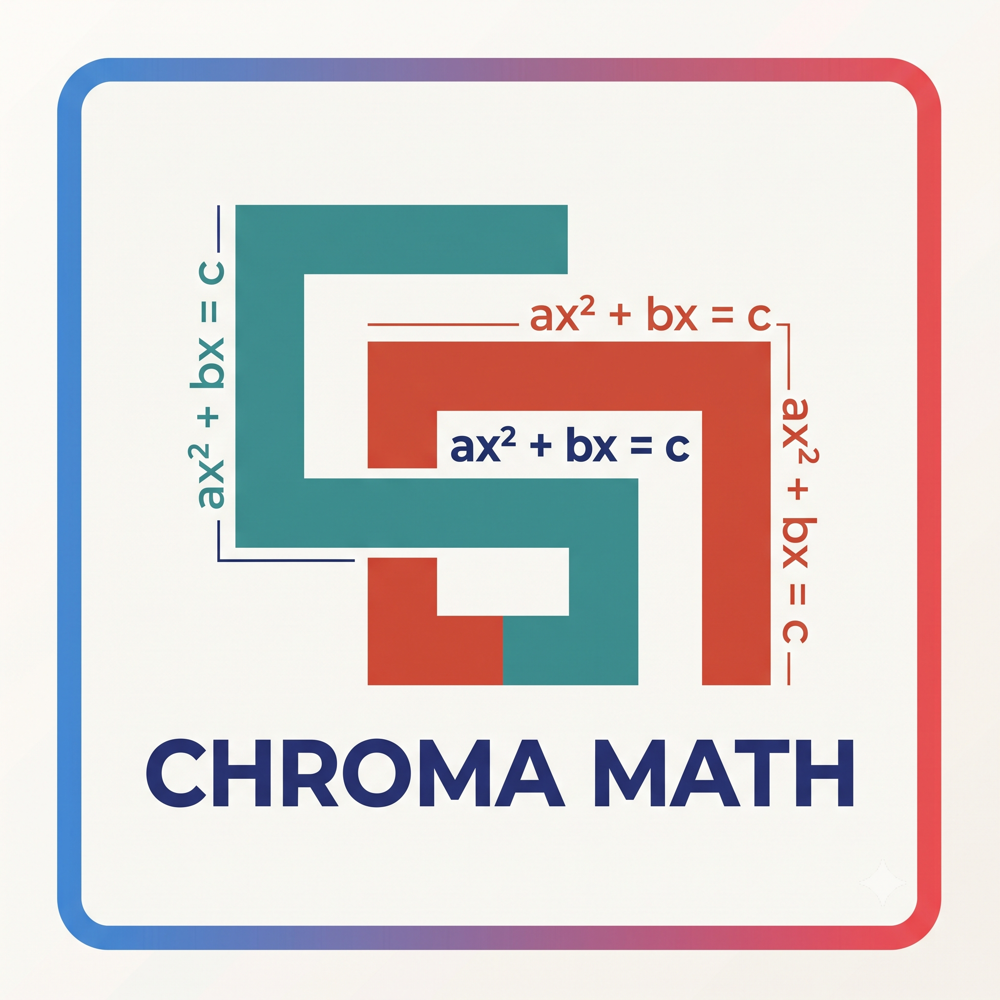

<p align="center">
  
</p>

<h1 align="center">ChromaMath</h1>

<p align="center">
  <strong>Intuitive, color-coordinated cognitive maps for mathematical formulas on arXiv.</strong><br />
  Inspired by Kalid Azad's <a href="https://betterexplained.com/articles/colorized-math-equations/">BetterExplained</a> & the <strong>ADEPT</strong> framework.
</p>

<p align="center">
  <a href="https://developer.chrome.com/docs/extensions/mv3/intro/"></a>
  <a href="https://react.dev/"></a>
  <a href="https://vitejs.dev/"></a>
  <a href="https://ai.google.dev/"></a>
  <a href="LICENSE"></a>
</p>

<p align="center">
  <a href="https://www.youtube.com/watch?v=EZisoGojics" target="_blank">
    
  </a>
  <br />
  <em>▶️ Click above to watch the ChromaMath demo on YouTube</em>
</p>

---

## 💡 What is ChromaMath?

Academic papers often introduce dense mathematical formulas with little intuition. ChromaMath translates complex notation into **color-coordinated cognitive maps**:

- **Color-Coded Decomposition**: Every mathematical chunk (operators, variables, limits, summations) receives a distinct semantic color.
- **Synchronized Narrative Sentence**: A plain-English sentence explains the formula where each phrase matches the exact color of the mathematical symbol it describes.
- **Bidirectional Hover Synesthesia**: Hovering over a mathematical symbol highlights its corresponding explanation phrase, and hovering over words highlights the exact symbol.
- **ADEPT Deep Dive**: Complete breakdown following Kalid Azad's ADEPT method:
  - 💡 **A**nalogy: Intuitive real-world mental model.
  - 📊 **D**iagram Concept: Visual representation of how the formula behaves.
  - 🔢 **E**xample: Concrete numerical walkthrough.
  - 📖 **P**lain Definition: Clear, jargon-free summary.
  - ⚙️ **T**echnical Definition: Rigorous formal definition with assumptions and bounds.

---

## 🎯 Designed for arXiv HTML Papers

> [!IMPORTANT]
> **ChromaMath is built specifically for arXiv HTML papers (`arxiv.org/html/*` and `ar5iv.org/*`).**

### Why arXiv HTML instead of downloaded PDFs?
* **Zero OCR Hallucinations**: arXiv HTML embeds semantic MathML and clean TeX directly in the webpage DOM. ChromaMath reads the true mathematical structure with 100% precision.
* **Instant Floating Wand (`✨ Explain`)**: As you read an arXiv HTML paper, simply hover over any formula. An elegant wand appears instantly for 1-click deconstruction.
* **Why downloaded PDFs don't work reliably**: Google Chrome strictly isolates downloaded and local PDFs inside a sandboxed internal PDF viewer (`chrome-extension://...` or `file:///`). Chrome's security model blocks extensions from injecting interactive content scripts or floating DOM overlays into native PDF tabs.

### ⚡ The 1-Second URL Trick for any arXiv Paper
If you are reading an arXiv paper in PDF format (`arxiv.org/pdf/...`) or abstract view (`arxiv.org/abs/...`), you can read it with ChromaMath in HTML immediately:
1. Replace `/pdf/` or `/abs/` with `/html/` in the URL:
   - `https://arxiv.org/abs/1706.03762` ➔ `https://arxiv.org/html/1706.03762`
2. Or use the [ar5iv](https://ar5iv.org) mirror:
   - `https://ar5iv.org/abs/1706.03762`
3. Enjoy clean, high-DPI HTML with full ChromaMath interactive equation support!

---

## 📖 How to Use

### 1. Browse any arXiv HTML Paper
Navigate to any arXiv paper in HTML, such as [Attention Is All You Need (1706.03762)](https://arxiv.org/html/1706.03762) or [Diffusion Models (2006.11239)](https://arxiv.org/html/2006.11239).

### 2. Hover over any Formula
Move your cursor over an equation. A floating **`✨ Explain`** wand appears next to it.

### 3. Deconstruct in the Side Panel
Click the wand to open the Chrome Side Panel:
- **Interactive Highlighting**: Hover over tokens in the equation to highlight their corresponding explanations in the narrative sentence.
- **ADEPT Tabs**: Switch between Analogy, Diagram, Example, Plain Definition, and Technical Definition.
- **Session History (LRU Cache)**: Switch between previously analyzed equations on the current paper without reloading or losing state.
- **Accessibility Controls**: Toggle between **Modern Vibrant** and **Okabe-Ito (CVD-Safe for colorblind readers)** palettes, enable numbered badges `[#]`, or view distinct underline patterns.

### 4. Manual LaTeX Input (Any Webpage)
Need to explain an equation outside arXiv HTML? Click **Paste TeX** in the Side Panel, enter any LaTeX expression (e.g. `\nabla \times \mathbf{E} = -\frac{\partial \mathbf{B}}{\partial t}`), and deconstruct it instantly.

---

## ⚡ Instant Offline Library (0ms, Zero API Cost)

ChromaMath includes pre-baked, production-grade deconstructions for foundational equations:
* **Transformer Scaled Dot-Product Attention**: $\text{Attention}(Q, K, V) = \text{softmax}\left(\frac{QK^T}{\sqrt{d_k}}\right)V$
* **Discrete Fourier Transform (DFT)**: $X_k = \frac{1}{N}\sum_{n=0}^{N-1} x_n e^{-i 2\pi k \frac{n}{N}}$
* **Euler's Constant (Continuous Growth)**: $e = \lim_{n \to \infty} (1 + \frac{1}{n})^{n}$
* **Bayes' Theorem**: $P(A|B) = \frac{P(B|A)P(A)}{P(B)}$
* **Categorical Cross-Entropy Loss**: $\mathcal{L} = -\sum_i y_i \log(\hat{y}_i)$

These formulas load **offline in < 1ms with no API key required**.

---

## 🔑 Adding a Free Gemini 2.0 API Key (For Novel Equations)

For new formulas outside the offline library, ChromaMath uses **Google Gemini 2.0 Flash**:
1. Get a free API key at [Google AI Studio](https://aistudio.google.com/app/apikey) (Free tier includes 1,500 requests/day, no credit card required).
2. Click the ⚙️ **Settings** gear icon in the ChromaMath Side Panel.
3. Paste your API key and click **Save Key**.
4. Keys are stored safely in Chrome's local storage and are never transmitted to external servers.

---

## 🚀 Installation & Local Development

### Prerequisites
- **Node.js**: v18.0.0 or higher
- **npm**: v9.0.0 or higher

### Build Steps
```bash
# 1. Clone the repository
git clone https://github.com/notabee/chromamath.git
cd chromamath

# 2. Install dependencies
npm install

# 3. Build the production extension
npm run build
```

### Load Extension into Google Chrome
1. Open Google Chrome and go to `chrome://extensions/`.
2. Toggle **Developer mode** in the upper-right corner.
3. Click **Load unpacked** in the top-left corner.
4. Select the `dist/` directory generated in `chromamath/dist`.
5. Pin **ChromaMath** to your Chrome toolbar.

---

## 🛠️ Tech Stack & Architecture

```
chromamath/
├── assets/                    # Project branding & UI preview screenshots
├── public/
│   ├── manifest.json          # Chrome Manifest V3 configuration
│   └── icons/                 # Extension toolbar icons (16px - 512px)
├── src/
│   ├── background/
│   │   ├── service-worker.ts  # Manifest V3 service worker & message hub
│   │   └── gemini.ts          # Gemini 2.0 Flash API structured JSON client
│   ├── content/
│   │   └── arxiv-detector.ts  # arXiv HTML & MathML scraper with floating wand
│   ├── sidepanel/
│   │   ├── App.tsx            # Side Panel layout & session history
│   │   └── components/
│   │       ├── InteractiveEquation.tsx  # KaTeX math with bidirectional hover
│   │       ├── NarrativeSentence.tsx    # Color-synchronized plain-English text
│   │       ├── AdeptView.tsx            # ADEPT framework tabs
│   │       ├── ComponentsGlossary.tsx   # Mathematical symbol table
│   │       └── SettingsModal.tsx        # Gemini API key & settings
│   └── shared/
│       ├── library.json       # Pre-baked iconic equation library
│       ├── palettes.ts        # Okabe-Ito & vibrant color palettes
│       └── types.ts           # TypeScript interfaces & data contracts
├── test/
│   └── arxiv-test.html        # Offline arXiv MathML test fixture
├── CONTRIBUTING.md            # Open-source contribution guidelines
└── LICENSE                    # MIT License
```

---

## 🤝 Contributing

Contributions are warmly welcomed! Whether adding iconic papers to the pre-baked formula library, optimizing scrapers for new arXiv HTML layouts, or improving accessibility features, please check out our [Contributing Guide](CONTRIBUTING.md).

---

## 📜 License

This project is licensed under the [MIT License](LICENSE).  
Copyright (c) 2026 notabee.
